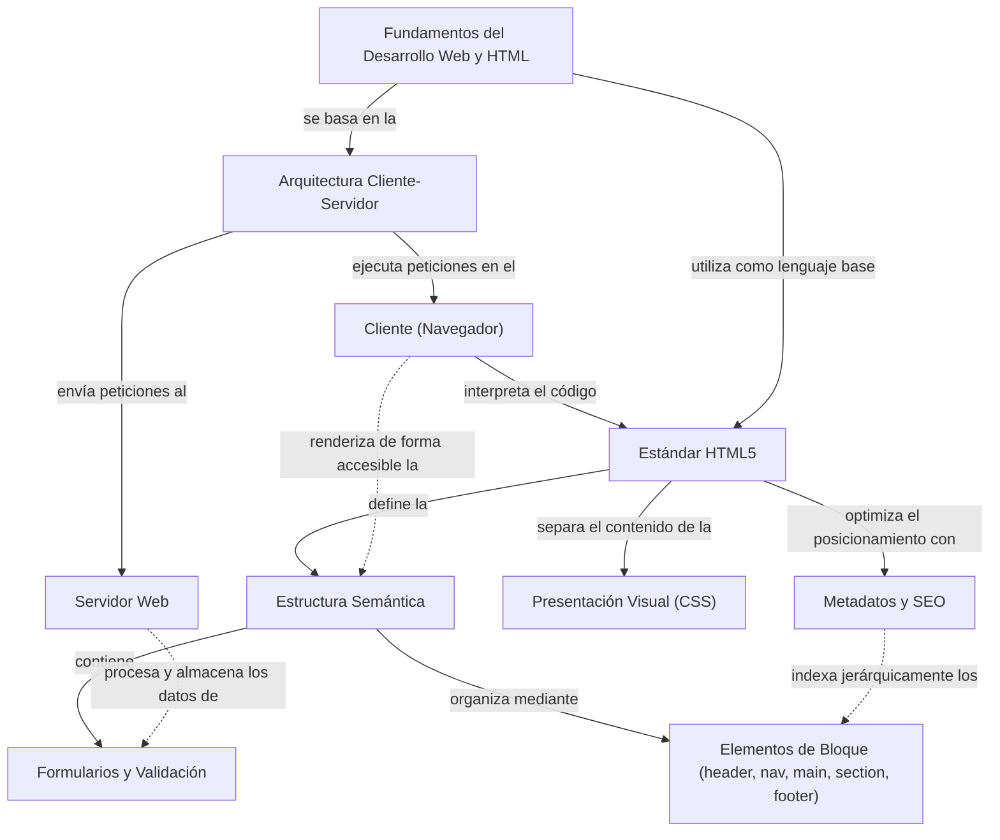

# Actividad 1: Fundamentos del Desarrollo Web y HTML

## Organizador Conceptual (Mapa de Fundamentos Web)

A continuación se presenta la arquitectura del mapa conceptual en formato de código semántico estructurado en Mermaid.js, diseñado bajo una jerarquía equilibrada, palabras de enlace explícitas en idioma español y múltiples enlaces cruzados que interconectan dimensiones distantes para facilitar la interpretación integral de los fundamentos web:

### Transcripción de la Arquitectura del Organizador Visual
Para garantizar la legibilidad y el análisis detallado de las relaciones jerárquicas representadas en el organizador, se desglosa el flujo conceptual de la siguiente manera:
*   **Concepto Central (Nivel 0):** Los fundamentos del desarrollo web y HTML5 articulan de manera simultánea la comunicación en red y la estructuración del contenido digital.
*   **Rama de Arquitectura (Nivel 1):** El desarrollo web se cimenta en la arquitectura distribuida Cliente-Servidor. El cliente (navegador) asume la responsabilidad de procesar e interpretar el marcado estándar, mientras que el servidor web atiende y responde a las solicitudes del protocolo HTTP.
*   **Rama de Estructuración (Nivel 2):** HTML5 opera como el núcleo del frontend, estableciendo una separación de responsabilidades estricta: define la estructura semántica de la información y la delega a CSS para su renderizado y presentación visual.
*   **Rama de Funcionalidad y Componentes (Nivel 3):** La estructura semántica del sitio se organiza mediante elementos de bloque estructurales y formularios interactivos con validación nativa en el cliente, apoyándose adicionalmente en metadatos para optimizar el posicionamiento técnico (SEO).
*   **Justificación de Enlaces Cruzados:** 
    *   *Cliente $\rightarrow$ Estructura Semántica:* El navegador del cliente renderiza de forma accesible y adaptada el marcado semántico estructurado.
    *   *Servidor $\rightarrow$ Formularios y Validación:* El servidor web recibe y procesa de forma segura los datos enviados a través del flujo interactivo de formularios.
    *   *SEO $\rightarrow$ Elementos de Bloque:* Los algoritmos de indexación de los motores de búsqueda rastrean la jerarquía semántica para estructurar la relevancia temática del sitio.

---

## Recursos Académicos e Investigaciones Asociadas

En cumplimiento con los estándares técnicos y la validez metodológica del entregable, se asocian y verifican los siguientes seis recursos de soporte especializados de tipología variada:

1.  **Consorcio W3C - Especificación Oficial de HTML5 (https://www.w3.org/TR/html52/):**
    *   *Propósito:* Norma técnica internacional que rige la sintaxis, compatibilidad del navegador y las APIs oficiales nativas del lenguaje de marcado.
2.  **MDN Web Docs - Guía Completa de HTML (https://developer.mozilla.org/es/docs/Learn/HTML):**
    *   *Propósito:* Repositorio de referencia y buenas prácticas mantenido por Mozilla que desglosa la aplicación de etiquetas semánticas y la jerarquía estructural.
3.  **Consorcio W3C - Servicio de Validación de Marcado HTML (https://validator.w3.org/):**
    *   *Propósito:* Herramienta formal de validación técnica que certifica la conformidad del código HTML5 respecto a los estándares sintácticos globales.
4.  **MDN Web Docs - Guía de Formularios Web y Validación Semántica (https://developer.mozilla.org/es/docs/Learn/Forms):**
    *   *Propósito:* Documentación técnica que detalla la arquitectura de campos de entrada, estados de validación nativa en el navegador y envío de datos.
5.  **WebAIM - Pautas de Accesibilidad al Contenido Web (WCAG 2.2) (https://webaim.org/):**
    *   *Propósito:* Guías internacionales que vinculan el marcado semántico estructural con los estándares de accesibilidad para lectores de pantalla.
6.  **Google Fonts Portal - Catálogo de Tipografías Web (https://fonts.google.com/):**
    *   *Propósito:* Repositorio tipográfico digital optimizado que permite la importación selectiva de fuentes mediante enlaces externos e instrucciones CSS.

---

## Coexistencia Temporal y Validez Teórica

En el análisis del desarrollo frontend, convive la literatura teórica fundacional clásica con los estándares tecnológicos dinámicos recientes:
*   **Bases Teóricas Clásicas:** Las teorías sobre arquitectura de información (Morville y Rosenfeld, 2006) y usabilidad de interfaces (Krug, 2014) definen principios cognitivos universales de organización de la información y ergonomía digital que permanecen inalterados en el tiempo.
*   **Estándares Modernos Vivos:** Estos principios universales se ejecutan técnicamente en la actualidad a través de estándares vivos en constante revisión (W3C HTML5.2, accesibilidad WCAG 2.2 de 2023, y guías de desarrollo de MDN).
*   **Síntesis:** La integración de ambas perspectivas metodológicas en este informe evita el sesgo de obsolescencia técnica al contrastar las leyes estables de experiencia de usuario y diseño con las últimas directrices de codificación frontend vigentes en el mercado contemporáneo.

---

## Modelo de Caja CSS y Composición de Espaciado

La maquetación visual estructurada en el navegador requiere un control milimétrico del espacio visual y responsivo. Todo elemento estructurado en el documento HTML5 se renderiza en el navegador como una caja rectangular gobernada por el **Modelo de Caja CSS (CSS Box Model)**:
*   **Contenido (Content):** El área interna donde reside el texto, imágenes o elementos de marcado reales de la etiqueta.
*   **Relleno (Padding):** Espacio transparente que separa el contenido del borde del elemento.
*   **Borde (Border):** Línea límite que envuelve el relleno y el contenido del elemento.
*   **Margen (Margin):** Espacio libre y transparente fuera del borde que establece la separación entre este elemento y las cajas adyacentes en el lienzo.

La maquetación semántica contemporánea aprovecha las etiquetas estructurales de HTML5 en combinación con las propiedades del modelo de caja para definir interfaces adaptativas, accesibles y libres de fricciones cognitivas en el diseño UI/UX.

---

## Definiciones Conceptuales y Fundamentación APA 7

### El Estándar HTML5
HTML5 es la quinta gran revisión del lenguaje de marcado estándar de la World Wide Web. Más allá de estructurar textos y enlaces, HTML5 representa una plataforma de desarrollo integral que elimina la dependencia de plugins propietarios al introducir soporte nativo para multimedia, almacenamiento local y elementos de maquetación altamente semánticos (Lawson y Sharp, 2011). Según el propio consorcio, HTML5 define "un vocabulario y las APIs asociadas para la creación de aplicaciones y páginas web modernas" (World Wide Web Consortium, 2014, p. 12).

### Planificación Estratégica en la Creación de Páginas Web
La planificación estratégica es la fase inicial y más crítica en el desarrollo de un sitio web, donde se definen los objetivos comerciales del proyecto, el público objetivo y las necesidades de los usuarios. Esta fase constituye el "Plano Estratégico", el nivel fundamental sobre el cual se construyen la arquitectura de información, los flujos de navegación y la interfaz visual (Garrett, 2011). La ausencia de esta planificación estratégica inicial depara en sitios web estéticamente agradables pero técnicamente ineficaces para cumplir objetivos corporativos o brindar una experiencia fluida (Morville y Rosenfeld, 2006).

### Diseño de Interfaz y Experiencia de Usuario (UI/UX)
El Diseño de Experiencia de Usuario (UX) abarca todas las interacciones del usuario final con la empresa, sus servicios y sus productos, enfocándose en la utilidad, facilidad de uso y eficiencia de los flujos (Norman, 2013). Por otro lado, el Diseño de Interfaz de Usuario (UI) se centra en la estética visual y los puntos de contacto interactivos. Un diseño UI/UX de alta calidad sigue principios cognitivos que minimizan la carga de memoria del usuario, permitiendo que la navegación por la interfaz sea completamente intuitiva y libre de fricciones cognitivas (Krug, 2014).

---

## Referencias

Garrett, J. J. (2011). *The Elements of User Experience: User-Centered Design for the Web and Beyond* (2nd ed.). New Riders.

Krug, S. (2014). *Don't Make Me Think, Revisited: A Common Sense Approach to Web Usability* (3rd ed.). New Riders.

Lawson, B., & Sharp, R. (2011). *Introducing HTML5* (2nd ed.). New Riders.

Morville, P., & Rosenfeld, L. (2006). *Information Architecture for the World Wide Web* (3rd ed.). O'Reilly Media.

Norman, D. (2013). *The Design of Everyday Things: Revised and Expanded Edition*. Basic Books.

World Wide Web Consortium. (2014). *HTML5: A vocabulary and associated APIs for HTML and XHTML*. W3C Recommendation. https://www.w3.org/TR/html5/
